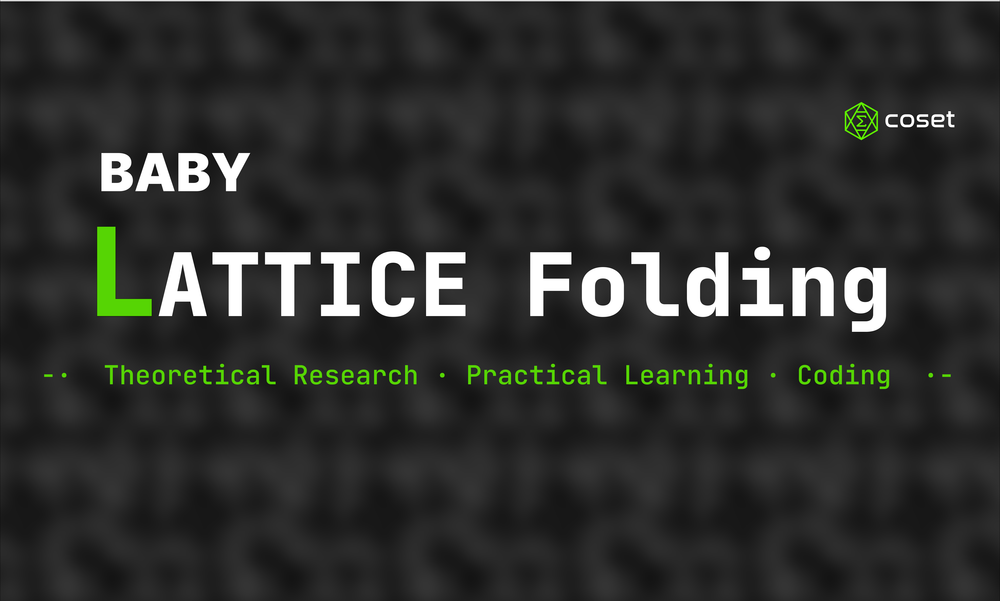

---

# baby-lattice-folding
This is an educational project aiming to build a Rust implementation of lattice-based folding schemes, progressing through theoretical research, practical code analysis, and hands-on development to understand lattice folding.

Our plan: 1. theoretical research, 2. practical learning, 3. coding

## 1. theoretical research

Goal: Read recent lattice-based folding schemes: Hypernova, Latticefold, Latticefold plus, Neo, SALSAA and Cyclo. Understand how lattice-based folding schemes are designed and the current bottlenecks.

Paper list:
1. [Hypernova](https://eprint.iacr.org/2023/573)
2. [Latticefold](https://eprint.iacr.org/2024/257)
3. [Latticefold+](https://eprint.iacr.org/2025/247)
4. [Neo](https://eprint.iacr.org/2025/294), [SuperNeo](https://eprint.iacr.org/2026/242)
5. [SALSAA](https://eprint.iacr.org/2025/2124)
6. [Cyclo](https://eprint.iacr.org/2026/359) 

Product: videos or lectures or blogs
1. Hypernova
    - Video:
        - [Hypernova 2023-08-25 by Guo Yu](https://www.youtube.com/watch?v=oRhA3pLvsV0)
        - [Hypernova 2023-11 by Chee](https://www.youtube.com/watch?v=B-oYutvzv6g)
        - [Hypernova: multifolding of CCS 2026-01-20 by Yingfei](https://www.youtube.com/watch?v=T_VaDGpESrI)
    - Notes:
        - [Hypernova 2023-08-25 by Guo Yu](./notes-paper/1-HyperNova%202023-08-25%20Guo%20Yu.pdf)
        - [Hypernova 2026-01-21 by Yingfei](./notes-paper/1-Hypernova%202026-01-21%20Yingfei.md)

2. Latticefold 
    - Notes: 
        - [Latticefold 2026-01-25](./notes-paper/2-latticefold%202024-04%20Yingfei.pdf)
        - [Latticefold 2024-04](./notes-paper/2-latticefold%202024-04%20Yingfei.pdf)
    - Video: [Latticefold 2026-01-25](https://youtu.be/pC4joC85axk)

3. Latticefold plus
    - Notes: [Latticefold 2026-02-08](./notes-paper/3-Latticefold_plus%202026-02-08.pdf) 
    - Video: [Latticefold 2026-02-08](https://youtu.be/nbOLpfmjFkQ)

4. SALSAA
    - Notes:
        - [Part 1: Norm-check 2026-03-01](./notes-paper/4-SALSAA-I-2026-03-01.pdf)
        - [Part 2: Folding scheme 2026-03-08](./notes-paper/4-SALSAA-I-2026-03-08.pdf)
    - Video: 
        - [Part 1: Norm-check 2026-03-01](https://youtu.be/GwlLW2gbi1U)
        - [Part 2: Folding scheme 2026-03-08](视频链接：https://youtu.be/8KlNRypo_T8)

5. Neo
    - Notes: [Neo by Kurt Pan](https://lattice.zkpunk.pro/wiki/cryptography/neo/)
    - Video:
      
6. Cyclo
    - Notes:
    - Video:

Schedule: every Sunday, 20:00 UTC+8
Timeline: 2026.01 ~ 2026.03

## 2. practical learning

Goal: Study existing code and understand benchmarks for lattice-based folding schemes.

Codes: 
 1. <https://github.com/NethermindEth/latticefold>
 2. <https://github.com/lattice-arguments/salsaa>

Product: educational notes

Timeline: 2026.04 ~ 2026.05

## 3. coding

Goal: We plan to develop baby lattice folding, an educational Rust implementation of the lattice-based folding scheme (SALSAA), building upon existing theoretical and practical foundations.

Product: codes

Timeline: 2026.06 ~ 2026.08

